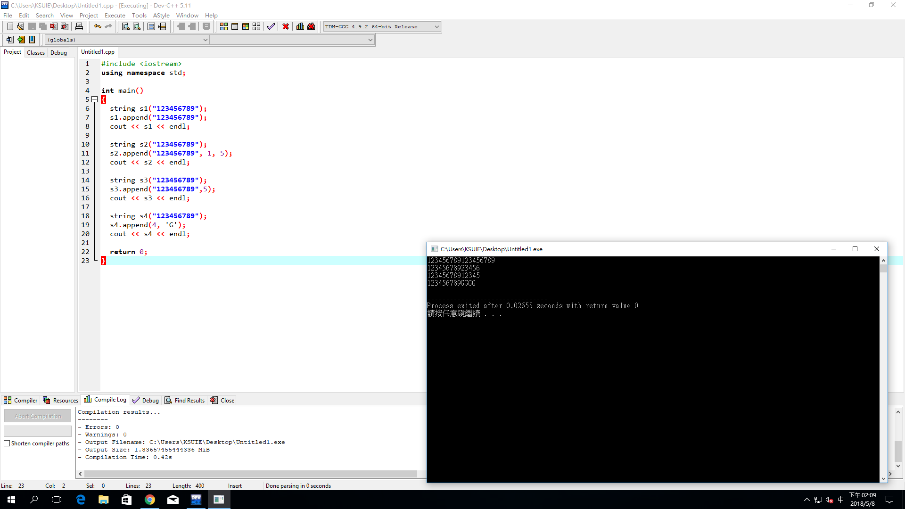

#include <iostream>
using namespace std;

int main()
{
  string s1("123456789");
  s1.append("123456789"); 
  cout << s1 << endl; 
  
  string s2("123456789");
  s2.append("123456789", 1, 5);
  cout << s2 << endl;

  string s3("123456789");
  s3.append("123456789",5);
  cout << s3 << endl;

  string s4("123456789"); 
  s4.append(4, 'G');
  cout << s4 << endl;

  return 0;
}

