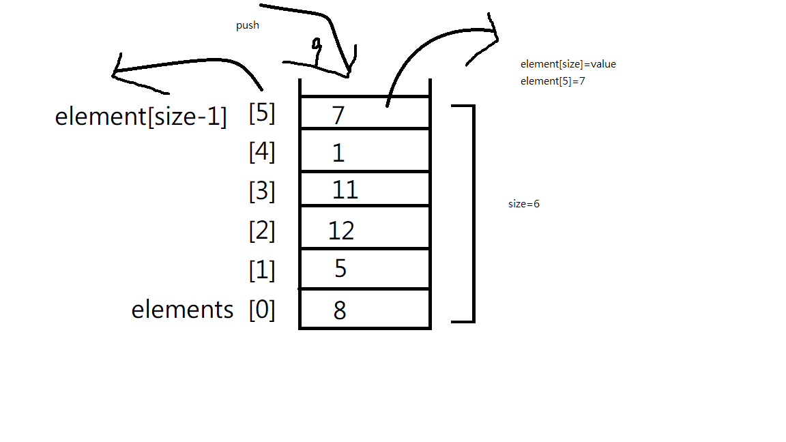

[1]定義 ==> StackOfIntegers.h
```
#ifndef STACK_H
#define STACK_H

class StackOfIntegers   //類別名稱 
{
public:                 //公開的::可以被存取 
  StackOfIntegers();    //建構子 
  bool isEmpty() const; //()測試是否為空的函數 
  int peek() const;//最上面元素的函數 
  void push(int value);//把資料丟入的函數 
  int pop();//取出最上層資料的函數 
  int getSize() const;//取出堆疊的大小函數 

private://隱藏的，私有的  1.把資料藏起來 2.使用上述的公開函數來存取 
  int elements[100];//整數類型的元素大小是100 
  int size;//整數類型的大小 
};

#endif
```

[2]實作==> StackOfIntegers.cpp
```
#include "StackOfIntegers.h"

StackOfIntegers::StackOfIntegers()//類別的建構子的實作 
{
  size = 0;//產生大小為0的StackOfIntegers的物件 
}

bool StackOfIntegers::isEmpty() const//測試是否為空的實作 
{//此函數執行後回傳的值為布林，真或假 
  return (size == 0);//()判斷式size==0若大小為零則回傳假; 若不為零則回傳真 
}

int StackOfIntegers::peek() const//取出最上層資料的實作 
{
  return elements[size - 1];//大小減一 回傳元素(最上層資料為多少) 
}

void StackOfIntegers::push(int value)//把資料丟入的實作 
{
  elements[size++] = value;//先執行 elements[size]=value 將值丟入元素，在執行size++，大小加一。 
}

int StackOfIntegers::pop()//取出最上層資料的實作(結果) 
{
  return elements[--size];//--size 先將大小減一，再回傳當前元素為多少 
}

int StackOfIntegers::getSize() const//取得堆疊大小的實作 
{
  return size;//回傳大小為多少 
}
```

[3]使用==>TestStackOfIntegers.cpp
```
#include <iostream>
#include "StackOfIntegers.h"
using namespace std;

int main() //main函數 
{
  StackOfIntegers stack;//堆疊 

  for (int i = 0; i < 10; i++)//i=0，i小於10，執行下面的程式再回來在執行i++ 
    stack.push(i);//堆疊執行方法 

  while (!stack.isEmpty())
    cout << stack.pop() << " ";

  return 0;//回傳0 
}
```


